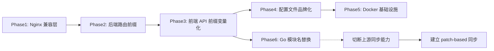

# AIDO 品牌迁移计划（待执行）

> **状态**: 规划中，暂缓执行
> **基准日期**: 2026-05-11
> **前置条件**: 语言精简（zh_CN/en_US only）完成

---

## 一、迁移范围总览

| 优先级 | 任务 ID | 描述 | 文件数 | 预估工作量 |
|---|---|---|---|---|
| P1 | R5 | Copyright 头部替换 | ~300+ | 2 天 (sed批量) |
| P1 | R6 | README.md 重写 | 3 | 0.5 天 |
| P1 | R7 | n9e-docs 路径→aido-docs | 13处代码+73文件 | 1 天 |
| P1 | R8-R10 | SSO文本/版本URL/documentMap | ~32处 | 0.5 天 |
| P2 | R1 | API前缀 /api/n9e/→/api/aido/ | 77前端+后端路由 | 3 天 |
| P2 | R2 | Go模块名替换 | 333+ .go | 0.5 天+回归 |
| P2 | R3 | 配置文件中品牌化 | 5 toml | 0.5 天 |
| P2 | R4 | Docker镜像+二进制名 | 5+3 文件 | 1 天 |
| P3 | R11-R20 | 内部引用清理 | ~20处 | 1 天 |

---

## 二、P1 — 用户可见品牌残留

### R5: Copyright 头部替换

**目标**: 所有 `src/` 下 `.ts/.tsx/.less` 文件的 `Copyright 2022 Nightingale Team` → `Copyright 2026 AIDO Team`

**方案**: 批量 sed 替换，排除 node_modules

```bash
find src/ -type f \( -name "*.ts" -o -name "*.tsx" -o -name "*.less" \) \
  -exec sed -i '' 's/Copyright 2022 Nightingale Team/Copyright 2026 AIDO Team/g' {} +
```

### R6: README.md 重写

**目标**: 清除所有指向 ccfos/nightingale、n9e.github.io、flashcat.cloud 的引用

### R7: n9e-docs 路径迁移

**目标**: 13 处代码中的 `/n9e-docs/` → `/aido-docs/`，73 个文档文件同步移动

### R8-R10: SSO/版本/document 链接

- SSO 本地化文本中的 "Nightingale" → "AIDO"（4 文件 6 处）
- 版本检查 URL: `ccfos/nightingale/releases` → 自有 URL
- documentMap 中 25+ 个 `flashcat.cloud` 链接 → 自有文档地址

---

## 三、P2 — 核心运行依赖

### R1: API 路由前缀

**方案**: 分两步执行

**Step 1**（Nginx 层兼容）:
```nginx
location /api/n9e/ {
    rewrite ^/api/n9e/(.*)$ /api/aido/$1 break;
    proxy_pass http://aido_backend;
}
```

**Step 2**（后端路由）:
```go
// center/router/router.go
pagesPrefix := "/api/aido"
// 保留 /api/n9e/ 重定向
pages.GET("/api/n9e/*path", redirectToPrefix("/api/aido"))
```

**Step 3**（前端 service 文件）:
```typescript
// src/utils/request.tsx
const API_PREFIX = import.meta.env.VITE_API_PREFIX || '/api/aido'
```

### R2: Go 模块名

```bash
# go.mod
module github.com/aido-platform/aido/v6

# 全局替换
find . -name "*.go" -exec sed -i '' \
  's|github.com/ccfos/nightingale/v6|github.com/aido-platform/aido/v6|g' {} +
go mod tidy
```

**风险**: 切断 `git merge ccfos/nightingale` 上游同步能力，需建立 patch-based 同步机制。

### R3: 配置文件品牌化

| 文件 | 需修改项 |
|---|---|
| `etc/config.toml` | DB名 `n9e_v6→aido_v6`, Header `X-From: aido`, TLS `/etc/aido/` |
| `etc/edge/edge.toml` | 同上 |
| `docker/compose-bridge/etc-nightingale/config.toml` | 同上 |

### R4: Docker 基础设施

| 组件 | 现状 | 目标 |
|---|---|---|
| 镜像 | `flashcatcloud/nightingale` | `aido-platform/server` |
| 二进制 | `n9e`, `n9e-cli`, `n9e-edge` | `aido`, `aido-cli`, `aido-edge` |
| 数据库 | `n9e_v6` | `aido_v6` |
| Kafka Topic | `n9e-metrics` | `aido-metrics` |
| Docker Compose 服务名 | `n9e`/`nightingale` | `aido` |

---

## 四、P3 — 内部引用清理

| ID | 项 | 文件 | 操作 |
|---|---|---|---|
| R11 | localStorage N9E_* | 4 处 | 迁移到 aido_* 前缀 |
| R12 | CSS 类名 n9e- | 2 处 | 替换为 aido- |
| R13 | 枚举值 n9e = 0 | 1 处 | 保留兼容值 |
| R14 | AIDO_PATHNAME 回退 | 1 处 | `'n9e'` → `'aido'` |
| R15 | VITE_PREFIX=/flashcat | 1 处 | `package.json` build script |
| R16 | n9e/elastic fork | 1 处 | go.mod replace |
| R17 | Prometheus 指标 n9e_* | 1 json | 后端代码修改 |
| R18 | compose 网络名 | 5 文件 | 重命名 |
| R19 | 二进制命名 | 3 文件 | goreleaser + Dockerfile |

---

## 五、数据流向

```text
迁移前:
  browser → /api/n9e/ → nginx → nightingale:17000 → n9e_v6 DB
                                                      → n9e-metrics Kafka
                                                      → X-From: n9e

迁移后:
  browser → /api/aido/ → nginx → aido:17000 → aido_v6 DB
                                                → aido-metrics Kafka
                                                → X-From: aido
                                                → 独立版本检查 API
```

---

## 六、执行顺序与依赖



**Phase 1-5**: 可并行执行，无上游依赖
**Phase 6**: 需在 Phase 1-3 完成后执行，且需要同步团队的确认
